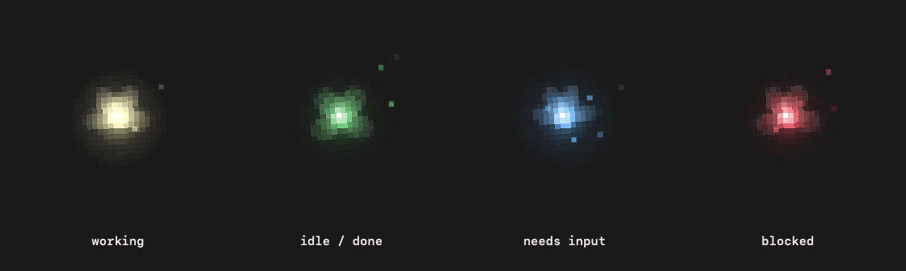
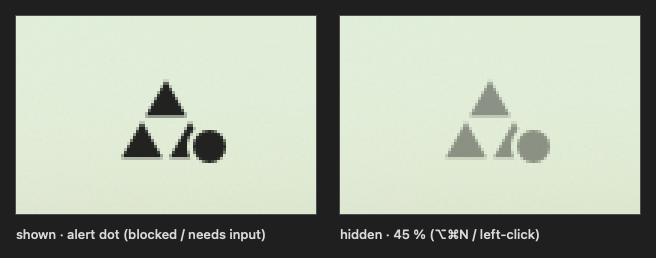

# Navi

A small glowing fairy that floats over every window on your Mac, follows your cursor, and
tells you with one color whether any of your coding agents need you.



Navi watches the agent sessions running on your machine — **Claude Code**, **Codex**, and
optionally **Omnigent** — and, if you point her at a git repo, its worktrees and pull
requests. Each piece of work in flight is one *build thread*: she turns yellow while an
agent is working, green when it finishes its turn and is waiting on you, blue when it asked
you something, red when something broke. Click her for the list; the last page of the menu
shows how much of each tool's quota you have used.

Everything runs locally. There are two parts:

| Part | Folder | What it does |
|---|---|---|
| **Collector** | `collector/` | A small Node daemon (no npm dependencies) that reads your agent sessions and writes one snapshot file, `~/.navi/threads.json`, within about half a second of anything changing. |
| **App** | `app/` | A Swift/AppKit app (no Dock icon, one menubar icon) that reads the snapshot and draws the fairy. |

## Requirements

- **macOS 14 (Sonoma) or newer**, Apple silicon or Intel.
- **Swift 5.9+** — Xcode 15+ or just the Command Line Tools (`xcode-select --install`).
- **Node 22.13 or newer** for the collector (it uses Node's built-in `WebSocket` and
  `node:sqlite`). Homebrew, nvm, Volta and `~/.local/bin` installs are found
  automatically; anything else, set `NAVI_NODE=/path/to/node`.
- **git**. Optional: the **GitHub CLI** (`gh`, signed in) for PR status on worktree rows.

## Install

```bash
git clone <this repo> navi && cd navi

# optional: track a repo's worktrees and PRs too
export NAVI_REPO=~/code/my-project

./install.sh --dry-run   # shows exactly what it will build, write and load
./install.sh
```

`install.sh` builds the app in release mode, wraps it as `~/Applications/Navi.app` (no Dock
icon, ad-hoc signed), and loads two per-user launchd agents whose paths point at **this
clone**:

| Agent | Runs | Log |
|---|---|---|
| `com.navi.collector` | `collector/run.sh` → `collect-daemon.mjs` (always kept running) | `~/Library/Logs/navi-collector.log` |
| `com.navi.app` | `~/Applications/Navi.app` (relaunched after a crash; a Quit from her menu stays quit) | `~/Library/Logs/navi.log` |

She appears bottom-right and follows the cursor. Drag her somewhere else and she remembers.
If you move the clone, run `./install.sh` again. On first launch macOS may ask whether Navi
may send notifications — allow it if you want the "is waiting on you" banners.

### Settings

launchd does not read your shell profile, so `install.sh` copies these from your environment
into both agents. Change one → re-run `./install.sh`.

| Variable | Default | Meaning |
|---|---|---|
| `NAVI_REPO` | *(unset)* | A git repo whose worktrees and PRs become rows. Without it, Navi still shows every live agent session, wherever it runs. |
| `NAVI_THREADS_PATH` | `~/.navi/threads.json` | The snapshot file. `notified.json`, `threads.prev.json` and `usage-cache.json` live next to it. |
| `NAVI_SFX_DIR` | `~/Library/Application Support/Navi/sfx` | Where Navi looks for your sound files (see [Sounds](#sounds)). |
| `NAVI_NODE` | auto-detect | Node binary for the collector. |
| `NAVI_NOTIFY_CMD` | *(unset)* | Shell command run when a thread starts needing you (reviewed PR waiting on your merge, branch gone stale). The message is `"$1"`, e.g. `NAVI_NOTIFY_CMD='terminal-notifier -message "$1"'`. |
| `NAVI_NO_USAGE` | *(unset)* | `1` = never poll quota providers; the usage page stays empty. |

## What Navi reads

Everything is read-only. Every source is optional; a missing one is reported in the snapshot's
`sources` and the rest still work.

| Source | Where | Needed for |
|---|---|---|
| Claude Code sessions | `~/.claude/sessions/*.json` (Claude Code's own session registry) | Claude Code rows — works out of the box |
| Claude Code hook state *(optional)* | `~/.claude/agent-state/*.json` | Finer states — see [below](#optional-claude-code-hook) |
| Codex sessions | `~/.codex/state_*.sqlite` + the running `codex` processes | Codex rows |
| Omnigent *(optional)* | `http://127.0.0.1:6767` (its local API) | Omnigent chat rows; skipped if it is not running |
| git worktrees *(optional)* | `git worktree list` in `NAVI_REPO` | worktree rows, dirty / unpushed / behind-main facts |
| Pull requests *(optional)* | one `gh pr list` in `NAVI_REPO` | PR number, title, merged / open |
| Review verdicts *(optional)* | `NAVI_REPO/.polly/registry.json` (Omnigent's polly orchestrator) | "PR reviewed, waiting on your merge" |
| Process table | `ps` / `lsof` | Which sessions are actually alive right now |

**A row exists only while a live agent backs it.** Closed sessions, sub-agents (they fold
into their parent's row), archived chats, and worktrees nobody is working in never show up
in Navi. Rows are named for people: PR title, else branch name, else the session's title,
else the folder name.

### Quota usage page

The last menu page shows one row per tool that has a quota, using the credentials those tools
already stored on your Mac. Each is polled at most every 1–10 minutes; the cache holds numbers
only, never a token.

| Row | Credential it reuses |
|---|---|
| Claude Code | the `Claude Code-credentials` keychain item (macOS may ask once to allow access) |
| Codex | `~/.codex/auth.json` (falls back to `codex app-server`) |
| Cursor | the `cursor-access-token` keychain item |
| Antigravity | the running IDE's local language server |
| OpenRouter | `~/.hermes/.env` or `~/.pi/agent/auth.json` |
| Nous | `~/.hermes/auth.json` |
| Omnigent | its local API (dollars today, no quota) |

A tool you do not use just shows a short reason, dimmed (no key found, app not running). Don't want
any of this? `NAVI_NO_USAGE=1 ./install.sh`.

### Optional Claude Code hook

Claude Code's own registry says *busy* or *idle*, which is enough for yellow/green. If you
want *blue* for "Claude is asking permission", wire `collector/hooks/agent-state.sh` into
`~/.claude/settings.json` (use the absolute path of your clone):

```json
{
  "hooks": {
    "UserPromptSubmit": [{ "hooks": [{ "type": "command", "command": "/path/to/navi/collector/hooks/agent-state.sh running" }] }],
    "Stop":             [{ "hooks": [{ "type": "command", "command": "/path/to/navi/collector/hooks/agent-state.sh waiting" }] }],
    "Notification":     [{ "hooks": [{ "type": "command", "command": "/path/to/navi/collector/hooks/agent-state.sh blocked" }] }],
    "SessionEnd":       [{ "hooks": [{ "type": "command", "command": "/path/to/navi/collector/hooks/agent-state.sh gone" }] }]
  }
}
```

It writes `~/.claude/agent-state/<session_id>.json`, never prints anything, and always
exits 0, so it cannot block a prompt. Merge these into any hooks you already have.

## What her color means

| Color | State | Means |
|---|---|---|
| **yellow** `#fff8ad` | working | an agent is mid-turn right now |
| **green** `#3fb950` | idle / done | the agent finished its turn, or nothing is going on |
| **blue** `#4aa8ff` | needs input | waiting on **you**: an agent asked a question or has an unread reply, or a PR is reviewed and ready to merge |
| **red** `#e5283a` | blocked | something broke: an agent failed, or a branch rotted behind main (20+ commits, or no commit for a week) |
| **white** `#ede6e6` | — | no live threads, or the collector is not running |
| **grey**, dim, slow wings | sleep | nothing changed for 10 minutes, or you put her to sleep |

- Several states at once → she rotates through them, one per second.
- Any change → a symbol pops above her (`⟳` `?` `!` `✓` `zzz`); on blocked she also shakes.
- **"Working" means the parent agent is mid-turn, nothing else.** When it finishes, the row goes
  green and you get a macOS notification *"<thread> is waiting on you"* (menubar menu →
  *Notify when an agent goes idle*).
- If the snapshot is more than 3 minutes old she treats the collector as down: one red
  "collector not running" row, white fairy. Nothing stale is ever shown as live.

## Using her

- **Click her** → the thread list, 6 per page, worst first or most recent first.
  Keys: `↑` `↓` move · `←` `→` page · `Tab` flip sort · `Enter` open · `Esc` close.
  Idle rows (no activity for 10 min) are dimmed and listed last.
- **Enter / click on a row** → a Claude Code or Codex row opens its PR if it has one, else a
  Terminal in its worktree. An Omnigent row opens the chat in the Omnigent app (or the browser —
  menubar menu → *Open chats in browser*). Right-click the fairy for the other actions.
- **Right-click her** → Hide · Sleep/Wake · Sound on/off · Open threads.json · Quit.
- **⌥⌘P** anywhere → sleep / wake. **⌥⌘N** anywhere → hide / show.
- **Menubar Triforce** (three triangles). A dot means something is blocked or needs input.
  Left-click hides/shows her; right-click for the menu (sound, notifications, config
  copy/paste/reset, open the sfx folder, Launch at Login — leave that off, the LaunchAgent
  already starts her at login).



She never takes focus and never appears in the Dock. Only the fairy herself catches clicks.

## Sounds

**Navi ships with no audio and is silent by default.** To give her a voice, drop your own
short clips into `~/Library/Application Support/Navi/sfx/` (or `NAVI_SFX_DIR`), then restart
her (`pkill -x Navi`; launchd brings her back):

| File name | Plays when |
|---|---|
| `menu-open` | the menu opens |
| `menu-close` | the menu closes |
| `menu-cursor` | the highlight moves to another row |
| `menu-select` | Enter on a row |
| `menu-turn` | page turn |
| `navi-in` | a symbol pops above her (any state change, rate-limited) |

Each name takes any of `.wav` `.aiff` `.aif` `.caf` `.m4a` `.mp3` (e.g. `navi-in.wav`).
Any you leave out stay silent; the menubar menu shows how many are missing. The repo's
`.gitignore` blocks audio files, so clips you experiment with inside the clone are never
committed — only use sounds you have the right to use.

## Uninstall

```bash
./install.sh --uninstall                                  # both agents + Navi.app
rm -rf ~/.navi                                            # snapshot, notification state, usage cache
rm -rf ~/Library/Application\ Support/Navi                # your sound files
defaults delete dev.navi.pet                              # position, config, prefs
rm -f ~/Library/Logs/navi.log ~/Library/Logs/navi-collector.log
```

`./install.sh --stop` only stops both until the next login. `pkill -x Navi` alone is not a
stop — launchd relaunches her. If you turned on Launch at Login, turn it off first (menubar
menu, or System Settings → General → Login Items).

## Troubleshooting

- **She is white and says "collector not running".** Look at
  `~/Library/Logs/navi-collector.log`. `FATAL: no node binary found` → install Node 22.13+ or
  set `NAVI_NODE` and re-run `./install.sh`.
- **A session you expect is missing.** Is its process still running? Sub-agents appear under
  their parent. Run `node collector/collect.mjs --table` to see what the collector sees and
  which sources are unavailable.
- **No PR info.** `gh auth status` must be signed in, and `NAVI_REPO` must be set.
- **Claude Code usage says "token stale".** Open Claude Code once so it refreshes its login.

## Development

```bash
cd app && swift build && swift test          # app + its unit tests (PetCore)
node --test collector/*.test.mjs             # collector tests (no network, no live services)

# run the app against any snapshot without installing
cd app && NAVI_THREADS_PATH=Tests/PetCoreTests/Fixtures/threads-sample.json swift run
```

More knobs: `NAVI_OPEN_MENU=1` (or `=usage`) opens the menu a second after launch,
`NAVI_MENUBAR_SHOT=<dir>` captures the menubar icon and quits, `NAVI_DEBUG=1` logs every
collect in the daemon. The collector's internals (event sources, state rules, snapshot
shape) are documented in [`collector/README.md`](collector/README.md).

```
app/Sources/PetCore/         pure logic, no AppKit — snapshot model, state mapping, colors, menu, sleep
app/Sources/BuildThreadsPet/ AppKit shell — panel, fairy scene, menu, sounds, menubar, hotkeys
app/Tests/PetCoreTests/      XCTest + a synthetic threads.json fixture
collector/                   collect.mjs (one-shot + library), collect-daemon.mjs, notify.mjs, usage.mjs
collector/hooks/            optional Claude Code hook (see above)
collector/raycast/           optional Raycast script command (add the folder in Raycast → Script Commands)
install.sh                   build + launchd install / stop / uninstall / dry-run
```

Navi is an unofficial fan-style homage; no Nintendo artwork or audio is included.
